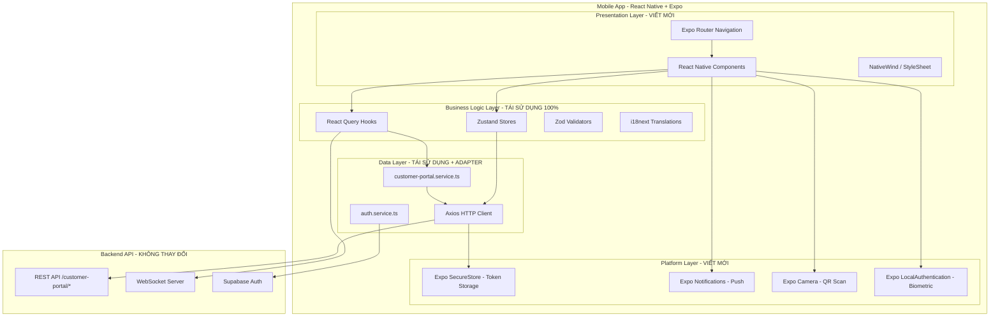
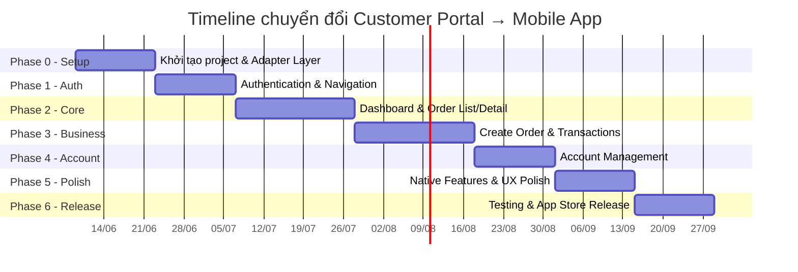

# 📱 Kế hoạch chuyển đổi Customer Portal → Mobile App (iOS & Android)

## 1. Tổng quan dự án

### 1.1 Mục tiêu
Chuyển đổi phân hệ `customer-portal` (hiện đang là bản Web chạy trên trình duyệt) thành một ứng dụng di động native chạy trên cả **iPhone (iOS)** và **Android**, giữ nguyên toàn bộ nghiệp vụ hiện có và tối ưu trải nghiệm người dùng (UX) cho thiết bị di động.

### 1.2 Phạm vi chức năng cần chuyển đổi

| # | Màn hình / Chức năng | File nguồn Web | Độ phức tạp |
|---|---|---|---|
| 1 | Dashboard tổng quan | `customer-dashboard.page.tsx` (~200 dòng) | 🟢 Thấp |
| 2 | Danh sách đơn hàng (+ filter, search, tabs) | `order-list.page.tsx` (~28KB) | 🟡 Trung bình |
| 3 | Chi tiết đơn hàng (tracking, QR, payment) | `order-detail.page.tsx` (~51KB) | 🔴 Cao |
| 4 | Tạo đơn hàng mới (MUA_HO, KY_GUI, CHUYEN_TIEN, DAU_GIA) | `create-order.page.tsx` + 5 sub-components (~90KB) | 🔴 Cao |
| 5 | Quản lý tài khoản (Profile, OTP, Addresses, Password) | `account-config.page.tsx` (~44KB) | 🔴 Cao |
| 6 | Lịch sử giao dịch | `transaction-history.page.tsx` (~19KB) | 🟡 Trung bình |
| 7 | Vận chuyển nội địa | `domestic-deliveries.page.tsx` (~44KB) | 🔴 Cao |
| 8 | Sidebar / Navigation | `customer-sidebar.component.tsx` (~17KB) | 🟡 Trung bình |
| 9 | Xác thực (Login, OTP, Supabase OAuth) | `features/auth/*` | 🟡 Trung bình |

---

## 2. Lựa chọn công nghệ

### 2.1 So sánh các phương án

| Tiêu chí | React Native + Expo | Flutter | PWA (Progressive Web App) |
|---|---|---|---|
| **Tái sử dụng code hiện tại** | ⭐⭐⭐⭐⭐ Rất cao (TypeScript, React Query, Zustand, Zod — dùng lại gần như 100% logic) | ⭐⭐ Thấp (phải viết lại bằng Dart) | ⭐⭐⭐⭐⭐ Giữ nguyên 100% |
| **Trải nghiệm Native** | ⭐⭐⭐⭐ Tốt | ⭐⭐⭐⭐⭐ Rất tốt | ⭐⭐ Kém (vẫn là web) |
| **Push Notification** | ✅ Native | ✅ Native | ⚠️ Hạn chế trên iOS |
| **Phát hành App Store / CH Play** | ✅ | ✅ | ❌ |
| **Biometric Auth (Face ID, Fingerprint)** | ✅ | ✅ | ⚠️ Hạn chế |
| **Camera / QR Scanner** | ✅ | ✅ | ⚠️ Hạn chế |
| **Thời gian phát triển** | ~3-4 tháng | ~5-6 tháng | ~2 tuần |
| **Chi phí nhân sự** | Dev React hiện tại có thể làm | Cần tuyển/đào tạo thêm Flutter Dev | Không cần thêm |

### 2.2 Đề xuất: React Native + Expo (SDK 53+)

> [!IMPORTANT]
> **React Native + Expo** là lựa chọn tối ưu nhất vì team hiện tại đã thành thạo React + TypeScript. Gần như toàn bộ tầng logic (services, hooks, types, stores, utils) có thể **tái sử dụng nguyên vẹn** mà không cần viết lại.

**Tech Stack cho Mobile App:**

| Layer | Web hiện tại | Mobile App | Tái sử dụng? |
|---|---|---|---|
| Language | TypeScript | TypeScript | ✅ 100% |
| UI Framework | React DOM + Ant Design | React Native + React Native Paper / Tamagui | ❌ Viết lại UI |
| Styling | Tailwind CSS | NativeWind (Tailwind cho RN) hoặc StyleSheet | 🔄 Chuyển đổi |
| Navigation | React Router DOM v7 | Expo Router (file-based routing) | 🔄 Chuyển đổi |
| State (Server) | @tanstack/react-query | @tanstack/react-query | ✅ 100% |
| State (Client) | Zustand | Zustand | ✅ 100% |
| Form & Validation | React Hook Form + Zod | React Hook Form + Zod | ✅ 100% |
| HTTP Client | Axios | Axios | ✅ 100% |
| Auth | Supabase + JWT | Supabase + JWT + Expo SecureStore | 🔄 Adapter |
| i18n | i18next | i18next | ✅ 100% |
| Realtime | Socket.io-client | Socket.io-client | ✅ 100% |
| Storage | localStorage | expo-secure-store / MMKV | 🔄 Adapter |

> [!TIP]
> **Ước tính tái sử dụng code: ~60-65%** tổng dự án. Phần phải viết lại chủ yếu là UI components (JSX → React Native components) và Navigation.

---

## 3. Kiến trúc dự án Mobile App

### 3.1 Cấu trúc thư mục đề xuất

```
tiximax-customer-app/
├── app/                          # Expo Router (file-based routing)
│   ├── (auth)/                   # Auth group (Login, Register, OTP)
│   │   ├── login.tsx
│   │   ├── register.tsx
│   │   └── verify-otp.tsx
│   ├── (tabs)/                   # Main tab navigator
│   │   ├── index.tsx             # Dashboard (Tab 1)
│   │   ├── orders.tsx            # Order List (Tab 2)
│   │   ├── create-order.tsx      # Create Order (Tab 3)
│   │   ├── transactions.tsx      # Transaction History (Tab 4)
│   │   └── account.tsx           # Account Settings (Tab 5)
│   ├── orders/
│   │   └── [id].tsx              # Order Detail (dynamic route)
│   ├── domestic-deliveries.tsx
│   └── _layout.tsx               # Root layout
├── src/
│   ├── components/               # UI Components (viết mới cho native)
│   │   ├── ui/                   # Atomic components (Button, Card, Badge, Input...)
│   │   ├── dashboard/            # Dashboard widgets
│   │   ├── orders/               # Order-related components
│   │   ├── transactions/         # Transaction components
│   │   └── account/              # Account/Profile components
│   ├── shared/                   # ✅ TÁI SỬ DỤNG TỪ WEB
│   │   ├── services/             # ✅ customer-portal.service.ts (giữ nguyên)
│   │   ├── hooks/                # ✅ use-customer-portal-data.ts (giữ nguyên)
│   │   ├── types/                # ✅ customer-portal.types.ts (giữ nguyên)
│   │   ├── lib/                  # 🔄 Adapter (http-client, auth-storage)
│   │   ├── stores/               # ✅ auth.store.ts (giữ nguyên logic)
│   │   └── utils/                # ✅ formatCurrency, formatDate (giữ nguyên)
│   ├── theme/                    # Design tokens cho mobile
│   │   ├── colors.ts
│   │   ├── typography.ts
│   │   └── spacing.ts
│   └── i18n/                     # ✅ Translation files (giữ nguyên)
├── assets/                       # Images, fonts, icons
├── app.json                      # Expo config
├── eas.json                      # EAS Build config
└── package.json
```

### 3.2 Sơ đồ kiến trúc tổng thể



---

## 4. Kế hoạch triển khai theo Phase

### Phase 0: Khởi tạo dự án & Hạ tầng (Tuần 1-2)

- [ ] Khởi tạo Expo project: `npx create-expo-app@latest tiximax-customer-app`
- [ ] Cấu hình TypeScript, ESLint, Prettier (đồng bộ với web)
- [ ] Setup Expo Router (file-based routing)
- [ ] Cài đặt dependencies chung: `@tanstack/react-query`, `zustand`, `axios`, `zod`, `react-hook-form`, `i18next`, `socket.io-client`
- [ ] Tạo **Platform Adapter Layer**:
  - `auth-storage.ts`: Thay `localStorage` → `expo-secure-store` cho token
  - `http-client.ts`: Copy nguyên từ web, chỉ đổi storage adapter
  - `notify.ts`: Thay `antd message` → `react-native Toast` hoặc `expo-notifications`
- [ ] Copy nguyên toàn bộ thư mục **tái sử dụng** từ web:
  - `shared/services/customer-portal.service.ts` ✅
  - `shared/hooks/use-customer-portal-data.ts` ✅
  - `shared/hooks/use-customer-profile.ts` ✅
  - `shared/types/customer-portal.types.ts` ✅
  - `features/auth/stores/auth.store.ts` ✅
  - Tất cả file `utils`, `constants`, `i18n` ✅
- [ ] Setup Design System cho mobile (colors, typography, spacing tokens)
- [ ] Tạo base UI components: `AppButton`, `AppCard`, `AppInput`, `AppBadge`, `StatusBadge`

**Deliverable:** App khởi chạy được trên Expo Go, có thể gọi API thành công.

---

### Phase 1: Authentication & Core Navigation (Tuần 3-4)

- [ ] Màn hình **Login** (Email/Password + Supabase OAuth Google)
  - Tích hợp `expo-auth-session` cho Google Sign-In
  - Tích hợp `expo-secure-store` để lưu JWT tokens
  - Xử lý luồng refresh token (tái sử dụng logic từ `http-client.ts`)
- [ ] Màn hình **OTP Verification** (Email + Phone)
  - Giao diện nhập 6 số kiểu native (auto-fill OTP nếu có)
  - Countdown resend OTP
- [ ] Màn hình **Register** (nếu có)
- [ ] Setup **Tab Navigator** chính với 5 tabs:
  - 🏠 Dashboard
  - 📦 Đơn hàng
  - ➕ Tạo đơn
  - 💰 Giao dịch
  - 👤 Tài khoản
- [ ] **Biometric Authentication** (Face ID / Fingerprint) cho lần đăng nhập tiếp theo
  - Dùng `expo-local-authentication`
- [ ] **Auth Guard**: Redirect về Login nếu chưa đăng nhập

**Deliverable:** Người dùng có thể Đăng nhập → Thấy Tab Navigation → Đăng xuất.

---

### Phase 2: Dashboard & Order List (Tuần 5-7)

- [ ] **Dashboard Screen** (chuyển từ `customer-dashboard.page.tsx`)
  - Overview Cards (Tổng KG, Tổng tiền, Đơn đang xử lý, Tổng đơn, Voucher)
    - Dùng `react-native-reanimated` cho micro-animations
  - Active Orders section (với `CustomerActiveOrderCard` viết lại cho native)
  - Recent Transactions section
  - Dedicated Staff card (avatar, tên, SĐT bấm gọi trực tiếp)
    - Tích hợp `Linking.openURL('tel:...')` để gọi điện trực tiếp
- [ ] **Order List Screen** (chuyển từ `order-list.page.tsx`)
  - Tab filter (Tất cả / Đang xử lý / Hoàn thành / Đã hủy)
  - Search bar với debounce
  - Advanced filter (date range, status, order type)
  - Infinite scroll pagination (thay vì pagination web)
    - Dùng `useInfiniteQuery` của React Query
  - Pull-to-refresh
  - Order card component (bấm vào → navigate sang Detail)
- [ ] **Order Detail Screen** (chuyển từ `order-detail.page.tsx` — màn hình phức tạp nhất)
  - Order info header (code, status badge, type)
  - Order links list (sản phẩm, hình ảnh, tracking code)
    - Bấm vào ảnh → full-screen image viewer
  - Tracking timeline (journey phases)
  - Shipping estimation table
  - Payment QR Code section
    - Dùng `expo-camera` để scan QR hoặc hiển thị QR bằng `react-native-qrcode-svg`
  - Payment history section
  - Process logs / Activity logs

**Deliverable:** Khách hàng có thể xem Dashboard, duyệt danh sách đơn, xem chi tiết đơn hàng đầy đủ.

---

### Phase 3: Create Order & Transactions (Tuần 8-10)

- [ ] **Create Order Screen** (chuyển từ `create-order.page.tsx`)
  - Order type selector (MUA_HO, KY_GUI, CHUYEN_TIEN, DAU_GIA)
  - Guard check: nếu profileCompletionLevel chưa đủ → hiển thị alert
  - **Purchase Form** (`customer-purchase-form.tsx`):
    - Chọn tuyến (Route selector)
    - Thêm nhiều links sản phẩm (dynamic form fields)
    - Upload ảnh sản phẩm (dùng `expo-image-picker`)
    - Chọn loại hàng (Product type selector)
    - Note / Ghi chú
    - Chọn địa chỉ nhận hàng
    - Submit → gọi API tạo đơn
  - **Deposit Form** (`customer-deposit-form.tsx`):
    - Tương tự Purchase Form nhưng cho hàng ký gửi
  - **Exchange Form** (`customer-exchange-form.tsx`):
    - Form chuyển tiền
  - Consultancy modal cho DAU_GIA (hiển thị info nhân viên hỗ trợ)
- [ ] **Transaction History Screen** (chuyển từ `transaction-history.page.tsx`)
  - Filter by type (DEPOSIT, PAYMENT, REFUND...)
  - Filter by purpose
  - Date range picker (dùng `react-native-date-picker`)
  - Infinite scroll list
  - Transaction detail modal
    - Hiển thị chi tiết giao dịch đầy đủ (chuyển từ `customer-transaction-detail-modal.component.tsx` — 37KB)
- [ ] **Domestic Deliveries Screen** (chuyển từ `domestic-deliveries.page.tsx`)
  - Danh sách shipment nội địa
  - Allingo tracking integration
  - Book / Cancel / Sync Allingo

**Deliverable:** Khách hàng có thể tạo đơn mới, xem lịch sử giao dịch, quản lý vận chuyển nội địa.

---

### Phase 4: Account Management & Settings (Tuần 11-12)

- [ ] **Account Screen** (chuyển từ `account-config.page.tsx`)
  - Profile header card (avatar, tên, mã KH, badge xác minh)
  - **Tab 1: Cài đặt chung**
    - Email notification
    - Delivery request options
  - **Tab 2: Cập nhật Profile**
    - Form: Họ tên, Email, SĐT, Nhân viên giới thiệu
    - Validate bằng Zod
  - **Tab 3: Quản lý địa chỉ**
    - Danh sách địa chỉ (SwipeAction: Edit / Delete)
    - Thêm/Sửa địa chỉ (Chọn Tỉnh/Huyện/Xã động)
    - Dùng `useVietnamDivisions` hook (tái sử dụng từ web)
  - **Tab 4: Tài khoản ngân hàng**
  - **Đổi mật khẩu / Tạo mật khẩu** (Bottom Sheet modal)
  - **Xác minh Email** (OTP flow)
  - **Xác minh SĐT** (OTP flow)
- [ ] **Settings Screen**
  - Chuyển ngôn ngữ (i18n: VI/EN/...)
  - Dark mode toggle (nếu cần)
  - Đăng xuất
  - Xóa tài khoản (nếu có)
  - App version info

**Deliverable:** Toàn bộ tính năng quản lý tài khoản hoàn chỉnh.

---

### Phase 5: Native Features & Polish (Tuần 13-14)

- [ ] **Push Notifications** (`expo-notifications`)
  - Nhận thông báo khi đơn hàng thay đổi trạng thái
  - Nhận thông báo khi có giao dịch mới
  - Deep link từ notification → màn hình tương ứng
- [ ] **Realtime Updates** (Socket.io)
  - Cập nhật trạng thái đơn hàng realtime trên Dashboard
  - Badge notification count trên tab
- [ ] **Offline Support cơ bản**
  - React Query `persistQueryClient` + MMKV storage
  - Cached data hiển thị khi mất mạng
  - Retry queue cho các action thất bại
- [ ] **Deep Linking / Universal Links**
  - `tiximax://orders/123` → Mở chi tiết đơn hàng
  - `https://app.tiximax.com/orders/123` → Universal Link
- [ ] **Performance Optimization**
  - `FlashList` thay `FlatList` cho danh sách dài
  - Image caching với `expo-image`
  - Skeleton loading screens
  - Haptic feedback (`expo-haptics`)
- [ ] **UX Polish**
  - Splash screen branded
  - App icon & adaptive icon
  - Onboarding screens (lần đầu sử dụng)
  - Error boundary & Crash reporting (Sentry)
  - Analytics (Mixpanel / Firebase Analytics)

**Deliverable:** App hoàn chỉnh với đầy đủ tính năng native, sẵn sàng cho testing.

---

### Phase 6: Testing & Phát hành (Tuần 15-16)

- [ ] **Testing**
  - Unit test cho shared logic (Jest — tái sử dụng test từ web)
  - Integration test cho các flow chính (Detox hoặc Maestro)
  - Manual QA trên các thiết bị:
    - iPhone 13/14/15 (iOS 16+)
    - Samsung Galaxy S-series (Android 12+)
    - Pixel devices
    - Các thiết bị tầm trung (Xiaomi, OPPO)
  - Performance profiling (memory, CPU, battery)
- [ ] **Build & Phát hành**
  - Setup EAS Build (`eas.json`) cho cả iOS và Android
  - Tạo tài khoản **Apple Developer** ($99/năm) nếu chưa có
  - Tạo tài khoản **Google Play Console** ($25 một lần) nếu chưa có
  - App Store Connect: Screenshots, descriptions, privacy policy
  - Google Play Console: Store listing, content rating
  - Internal Testing → Beta Testing → Production Release
- [ ] **CI/CD**
  - GitHub Actions / GitLab CI tích hợp EAS Build
  - Auto build khi merge vào `main`
  - OTA Updates bằng `expo-updates` (hotfix không cần qua store review)

**Deliverable:** App lên App Store và Google Play.

---

## 5. Mapping chi tiết: Web Component → Mobile Component

### 5.1 Navigation

| Web | Mobile |
|---|---|
| `CustomerShellLayout` (Sidebar + Header + Outlet) | `app/(tabs)/_layout.tsx` (Bottom Tab Navigator) |
| `CustomerSidebarComponent` (17KB side nav) | Bottom Tab Bar (5 tabs) + Drawer menu (nếu cần) |
| `react-router-dom` `<Link>`, `useNavigate` | `expo-router` `<Link>`, `router.push()` |
| Header breadcrumb (Home / Page Title) | Stack header với back button |

### 5.2 UI Component Mapping

| Web (Ant Design) | Mobile (React Native) |
|---|---|
| `<Button>` | `<Pressable>` / React Native Paper `<Button>` |
| `<Card>` | Custom `<AppCard>` với `<View>` + shadow |
| `<Modal>` | `<BottomSheet>` (react-native-bottom-sheet) |
| `<Drawer>` | `<BottomSheet>` hoặc Drawer navigation |
| `<Tabs>` | `<SegmentedControl>` hoặc top tabs |
| `<Form>`, `<Form.Item>` | React Hook Form + custom `<FormField>` |
| `<Select>` | `<Picker>` hoặc `<BottomSheetSelect>` |
| `<Input>` | `<TextInput>` styled |
| `<Avatar>` | `<Image>` hoặc `expo-image` |
| `<Popconfirm>` | `Alert.alert()` native |
| `<Empty>` | Custom empty state component |
| `<message.success/error>` | `react-native-toast-message` |
| `<Radio.Group>` | Custom radio buttons |
| Tailwind CSS classes | NativeWind hoặc StyleSheet.create |

---

## 6. Ước tính nguồn lực

### 6.1 Team đề xuất

| Vai trò | Số lượng | Ghi chú |
|---|---|---|
| React Native Developer | 2 | Dev React hiện tại có thể chuyển sang nhanh |
| UI/UX Designer (Mobile) | 1 | Thiết kế lại giao diện tối ưu cho mobile |
| QA Tester | 1 | Test trên nhiều thiết bị |
| Backend Developer | 0.5 | Hỗ trợ Push Notification API, Deep Link |
| Project Manager | 0.5 | Điều phối tiến độ |

### 6.2 Timeline tổng thể



> **Tổng thời gian ước tính: ~14-16 tuần (3.5 - 4 tháng)**

### 6.3 Chi phí ước tính bổ sung

| Hạng mục | Chi phí |
|---|---|
| Apple Developer Account | $99/năm |
| Google Play Console | $25 (một lần) |
| EAS Build (Expo) | Free tier hoặc ~$15/tháng (Production) |
| Sentry (Crash Reporting) | Free tier đủ dùng ban đầu |
| Push Notification Service | Free (Expo Push / Firebase Cloud Messaging) |

---

## 7. Rủi ro & Giải pháp

| Rủi ro | Mức độ | Giải pháp |
|---|---|---|
| Ant Design components không có native equivalent | 🔴 Cao | Viết custom components hoặc dùng React Native Paper/Tamagui |
| Màn hình Order Detail quá phức tạp (51KB) | 🔴 Cao | Chia nhỏ thành nhiều section components, lazy load tabs |
| Form tạo đơn hàng có nhiều trường động | 🟡 TB | Dùng `react-hook-form` `useFieldArray` (tương tự web) |
| Review App Store bị reject | 🟡 TB | Tuân thủ HIG (Apple), chuẩn bị metadata kỹ |
| Performance trên thiết bị cũ/yếu | 🟡 TB | Optimize render, dùng `FlashList`, lazy load images |
| Team chưa có kinh nghiệm React Native | 🟢 Thấp | React Dev chuyển sang RN rất nhanh (~1-2 tuần onboard) |

---

## 8. Câu hỏi cần xác nhận trước khi bắt đầu

> [!IMPORTANT]
> Cần xác nhận các câu hỏi sau trước khi khởi động Phase 0:

1. **UI Library**: Bạn muốn dùng UI library nào cho mobile?
   - **React Native Paper** (Material Design — đơn giản, ổn định)
   - **Tamagui** (Universal UI — hiệu năng cao, hỗ trợ cả web & native)
   - **Viết custom hoàn toàn** (tự do 100%, nhưng tốn thời gian hơn)

2. **Monorepo hay Repo riêng?**
   - **Monorepo** (dùng Turborepo/Nx): Code shared giữa web & mobile ở packages chung → dễ sync. Phức tạp cấu hình ban đầu.
   - **Repo riêng**: Copy code shared sang mobile project → đơn giản hơn, nhưng phải manual sync khi web thay đổi.

3. **Push Notification backend**: Hệ thống backend hiện tại đã có API cho Push Notification chưa? Nếu chưa, cần phối hợp backend dev bổ sung.

4. **Design riêng cho Mobile**: Bạn muốn thiết kế UI mobile **y hệt bản web** (chỉ responsive lại), hay muốn **redesign** giao diện tối ưu cho trải nghiệm mobile (thumb-friendly zones, gestures, bottom sheets...)?

5. **Phạm vi MVP**: Nếu muốn ra app nhanh, bạn muốn ưu tiên chức năng nào cho bản đầu tiên (MVP)?
   - Chỉ Dashboard + Xem đơn hàng + Tracking
   - Toàn bộ chức năng (bao gồm tạo đơn, giao dịch...)
